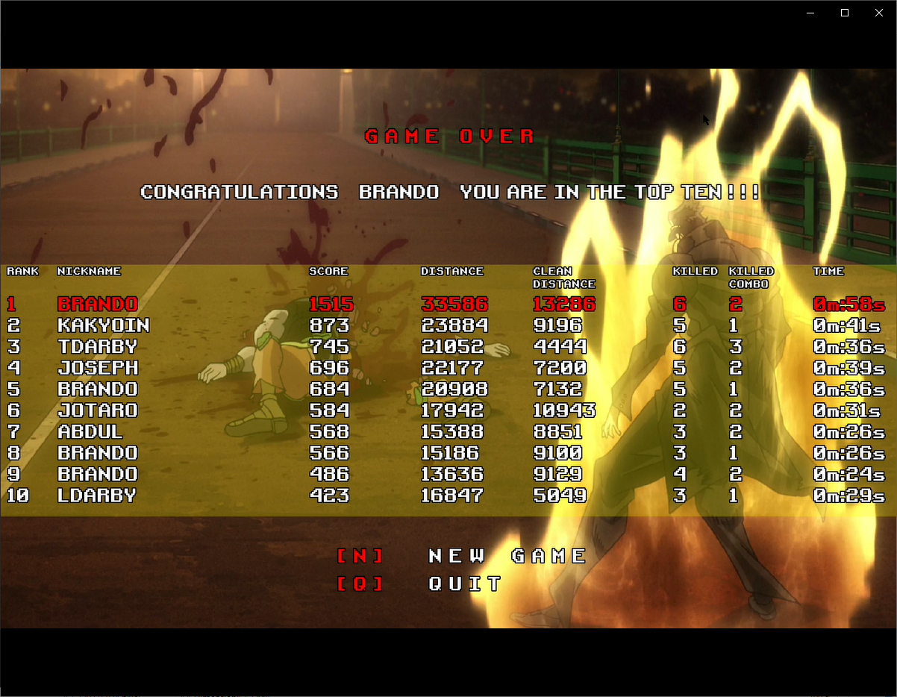

# Jojo-Run
Gioco sviluppato da

* **Niccolò Menghini**  <niccolo.menghini@stud.unifi.it>

* **Angiolo Giandonati** <angiolo.giandonati@stud.unifi.it>

per l'esame di "Fondamenti di Programmazione", 
I del anno corso di Laurea Triennale in Ingegneria Informatica.

# Descrizione
Gioco endless-runner 2D con gestione della gravità e delle collisioni.

Ispirato al manga "Le Bizzarre Avventure di JoJo" di Hirohiko Araki.

#Struttura del gioco
Il gioco è sviluppato in c++11 e basato sulle [librerie SFML](www.sfml-dev.org) rilasciate con licenza ZLIB/PNG.

Di seguito i componenti principali e loro breve descrizione:

## Game

Classe principale, crea la finestra, gestisce il loop degli eventi, crea la macchina a stati (StateMachine), crea le classi di contesto del gioco (GameConfig, GameStats, ResourceManager, SceneManager, ScoreManager, Factory)
Nel game loop viene fatto il calcolo del tempo trascorso per la gestione del framerate.

## StateMachine

**InitState** è lo stato iniziale del gioco per eventuali inizializzazioni

**MenuState** è il menu iniziale [1] gioca [2] credits

**PlayState** è lo stato che crea e gestisce il livello di gioco. Qui è integrata la pausa [P]

**GameOverState** è lo stato finale del gioco che chiede il nome, fa vedere e salva lo score, e permette di uscire [Q] o ripartire con un nuovo gioco [N]

## GameContext
Oggetti condivisi

**GameConfig** contiene alcuni parametri di configurazione del gioco

**GameStats** contiene i dati statistici prodotti durante il gioco

**ResourceManager** carica gli asset di gioco (textures, sounds, fonts) ed implementa un meccanismo di caching rudimentale

**SceneManager** contiene tutta la logica di aggiornamento e rendering del livello di gioco.
In questa classe il metodo **generateMap** genera in modo pseudo-casuale piattaforme, nemici, ostacoli, potenziamenti. Il metodo **generateBackground** genera lo sfondo di background che si muove in maniera relativa rispetto alla velocità della scena.

**CollisionManager** è la classe a cui è delegato il calcolo delle collisioni. Ad ogni collisione viene inoltrato un evento **Event** alle Entity interessate. Le collisioni sono controllate per categorie:
 * eroe-piattaforma
 * eroe-nemico
 * eroe-proiettile
 * eroe-ostacolo
 * eroe-potenziamento
 * nemico-piattaforma
 * nemico-coltello

La classe **ScoreHUD** è infine una Entity in 'overlay' sulla scena costituito da un insieme di widget che visualizzano le informazioni di gioco.
**ScoreHUD** e **Widget** sono observer di **GameStats** e **ScoreManager**.

**Factory** è la factory class per la creazione delle entità. La classe cfrea l'associazione tra una entity, una o più animazioni, uno o più suoni.

**ScoreManager** controlla gli stats e produce i dati di punteggio, implementa le regole dei bonus, crea e riordina i record di punteggio, gestisce il salvataggio su file (creazione e rilettura).

**InputManager** gestisce gli eventi della tastiera e comunica se un tasto è premuto/rilasciato o 'appena' stato premuto/rilasciato.

## Widgets
Oggetti generici per la visualizzazione di testo e immagini.

Sono concatenabili e aggiornabili in modo ricorsivo.

## Entities

Oggetti visualizzati nella scena.

Fanno tutti capo ad una classe base **Entity** che contiene le regole di aggiornamento della posizione. 
Una Entity ha una posizione, una dimensione, una velocità e un frame.
La funzione **update** oltre che muovere l'oggetto integra la gestione della fisica legata alla gravità. 
I calcoli sono basati sulla velocità corrente dell'oggetto e la velocità della scena.
E' possibile dare alla entity un impulso (un'accelerazione per un tot di tempo) in corrispondenza di eventi.
La funzione render aggiorna lo schermo secondo il frame corrente e la posizione calcolata.

**AnimationManager** è la classe che gestisce le animazioni. 
Per ogni entity ci sono N animazioni **Animation** ciascuna contenente M frame (sf::Sprite).
Ogni frame ha la sua dimensione (che può essere diversa), la hitbox è aggiornata di conseguenza. 
Il frame è calcolato in fase di creazione in base ai parametri **FrameParameters** passati nella **add**. 
Ad ogni update questa classe provvede a comunicare alla Entity quale è il un nuovo frame. 
Per creare animazioni più o meno lente si aggiungono più o meno frame identici.
Le animazioni cambiano in base allo stato dell'oggetto.

**SoundManager** gestisce le risorse audio (musica ed effetti speciali). 
I suoni sono emessi in relazione agli eventi e alle animazioni attive. 
La SFML esegue i suoni in un thread separato rispetto al loop eventi.

Ci sono 6 categorie di Entity:

**Hero** l'eroe che implementa la meccanica più complessa.
Gestisce il salto (barra spaziatrice) ascoltando gli eventi tastiera (dalla **InputManager**) e discriminando tra pressione breve, media, lunga.
Implementa il lancio dei coltelli (tasto K) che possono essere raccolti come potenziamenti. 
E' soggetto alla legge di gravità con limitazione della velocità in salto e in caduta per una buona giocabilità. 
Reagisce con un piccolo scostamento verso l'alto in caso di impatto con nemici e proiettili.
Rimbalza in caso di atterraggio su un nemico.
Infine ha la gestione dello scudo che può essere raccolto anch'esso come potenziamento.
Ogni impatto porta un danno specifico che decrementa il valore health.
L'eroe muore in caso di esaurimento punti vita o caduta nel vuoto. 

**Mappa**  oggetti di background, che non inetragicono con nessuno, e piattaforme che interagiscono con eroe e nemici.
In particolare, per l'eroe, la collisione è gestita distinguendo tra l'atterraggio con i piedi e l'impatto con la testa. 
L'impatto frontale è invece invalidato per rendere più giocabile l'azione.
Elementi di background e piattaforme sono distrutti una volta che escono dalla scena e rigenerati a ciclo continuo.

**Obstacle** gli oggetti ostacolo che recano danno all'eroe in caso di collisione senza essere distrutti.
Gli ostacoli, (il fuoco e la sfera elettrica) sono eliminati se escono dalla scena.

**Powerup** gli oggetti che portano potenziamento all'eroe (scudo, coltelli): spariscono dopo la collisione.
I potenziamenti (lo scudo e i coltelli) sono eliminati se escono dalla scena.

**Bullet** sono i proiettili che feriscono eroe e nemici.
I proiettili (fuoco, smeraldo, coltello) sono eliminati se escono dalla scena.

**Enemy** sono i nemici con comportamento specializzato: 
* FireEnemy spara
* HamonEnemy salta
* EmeraldEnemy salta e spara. 

I nemici sono eliminati in caso di collisione con l'eroe o se escono dalla scena.

Il calcolo del punteggio è basato sulla distanza percorsa (unita=numero di pixel/100) e numero di nemici uccisi.
Alcuni bonus, visualizzati durante il gioco, sono calcolati su alcuni step di distanza,
alcuni step di nemici uccisi, numero di nemici uccisi consecutivamente, distanza massima
percorsa senza ricevere danni.
Come step finale è presentata una statistica dell'ultima sessione di gioco e il ranking.
A completamento viene visualizzata la top ten ed un eventuale messaggio di gratificazione.

## Demo

###Videoclip

Clip1

Clip2

Clip3

Clip4

###Screen shots

Menu iniziale

Credits

Partenza

Salto

Collisione nemici

Fuoco nemico

Lancio coltello

Azioni combinate

Ostacoli

Morte nemico

Score ed achievements

Morte eroe

Registrazione finale

Record, statistiche e salvatggio su file

